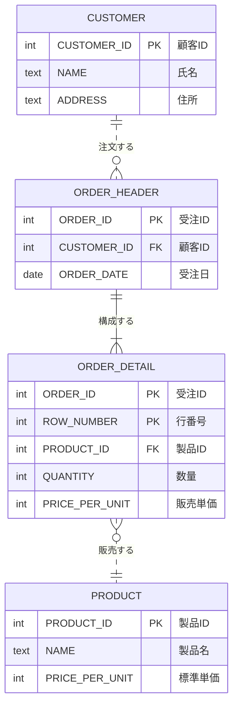
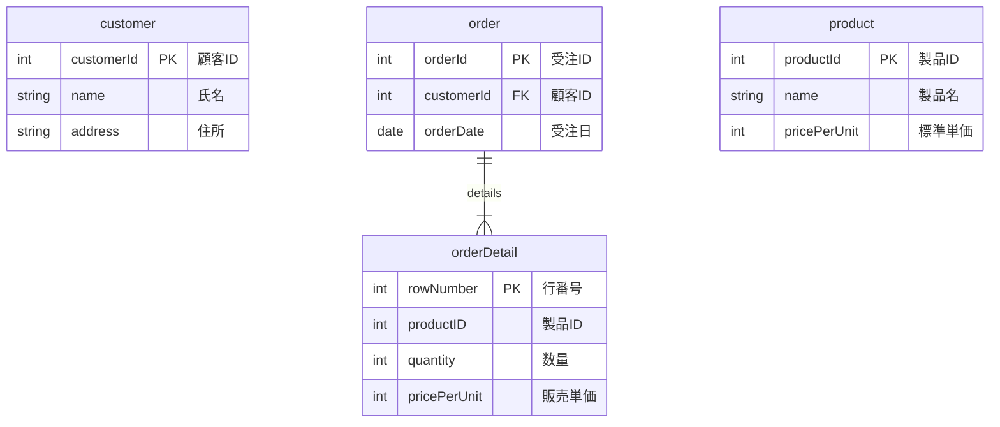
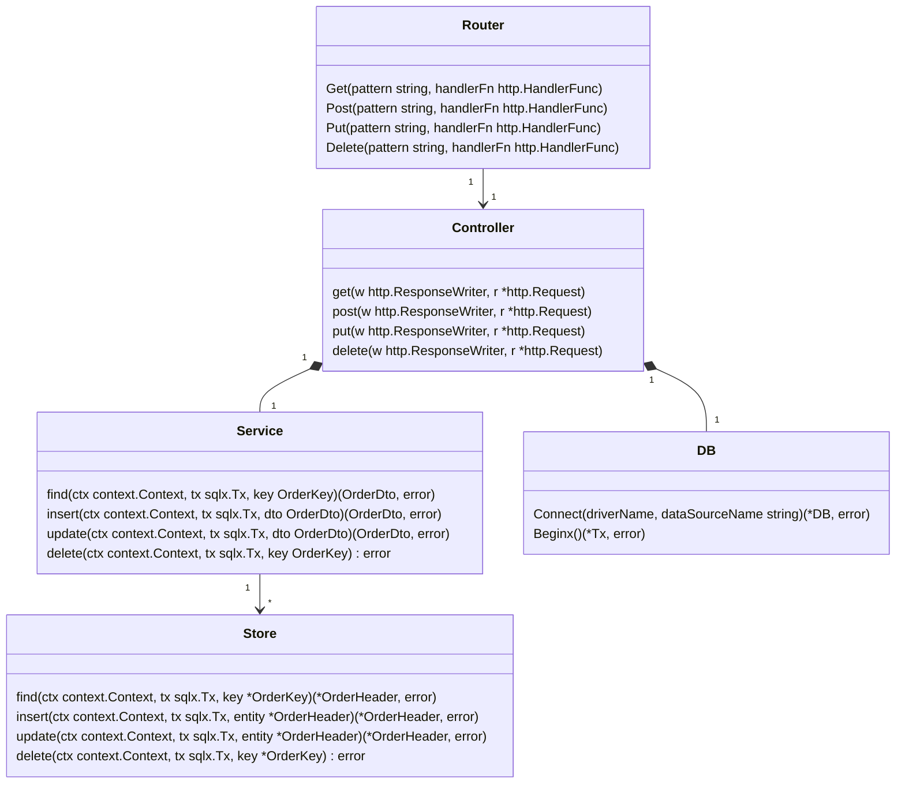

# Golang による RDBMS をデータソースとする REST API のサンプル

## 外部仕様

### データベース

- 以下の４テーブルを対象とする

```mermaid
erDiagram
    CUSTOMER ||..o{ ORDER_HEADER : "注文する"
    CUSTOMER {
        int CUSTOMER_ID PK "顧客ID"
        text NAME "氏名"
        text ADDRESS "住所"
    }
    ORDER_HEADER ||--|{ ORDER_DETAIL : "構成する"
    ORDER_HEADER {
        int ORDER_ID PK "受注ID"
        int CUSTOMER_ID FK "顧客ID"
        date ORDER_DATE "受注日"
    }
    ORDER_DETAIL {
        int ORDER_ID PK "受注ID"
        int ROW_NUMBER PK "行番号"
        int PRODUCT_ID FK "製品ID"
        int QUANTITY "数量"
        int PRICE_PER_UNIT "販売単価"
    }
    ORDER_DETAIL }o..|| PRODUCT : "販売する"
    PRODUCT {
        int PRODUCT_ID PK "製品ID"
        text NAME "製品名"
        int PRICE_PER_UNIT "標準単価"
    }
```

### REST リソース

- 従属エンティティである ORDER_DETAIL は 独立エンティティである ORDER_HEADER に吸収させて３リソースにする

```mermaid
erDiagram
    customer {
        int customerId PK "顧客ID"
        string name "氏名"
        string address "住所"
    }
    order ||--|{ orderDetail : "details"
    order {
        int orderId PK "受注ID"
        int customerId FK "顧客ID"
        date orderDate "受注日"
    }
    orderDetail {
        int rowNumber PK "行番号"
        int productID "製品ID"
        int quantity "数量"
        int pricePerUnit "販売単価"
    }
    product {
        int productId PK "製品ID"
        string name "製品名"
        int pricePerUnit "標準単価"
    }
```

## 内部設計

### クラス？図

```mermaid
classDiagram
    Router "1" --> "1" Controller
    class Router {
        Get(pattern string, handlerFn http.HandlerFunc)
        Post(pattern string, handlerFn http.HandlerFunc)
        Put(pattern string, handlerFn http.HandlerFunc)
        Delete(pattern string, handlerFn http.HandlerFunc)
    }
    Controller "1" *-- "1" Service
    Controller "1" *-- "1" DB
    class Controller {
        get(w http.ResponseWriter, r *http.Request)
        post(w http.ResponseWriter, r *http.Request)
        put(w http.ResponseWriter, r *http.Request)
        delete(w http.ResponseWriter, r *http.Request)
    }
    class DB {
        Connect(driverName, dataSourceName string) (*DB, error)
       Beginx() (*Tx, error)
    }
    Service "1" --> "*" Store
    class Service {
        find(ctx context.Context, tx sqlx.Tx, key OrderKey) (OrderDto, error)
        insert(ctx context.Context, tx sqlx.Tx, dto OrderDto) (OrderDto, error)
        update(ctx context.Context, tx sqlx.Tx, dto OrderDto) (OrderDto, error)
        delete(ctx context.Context, tx sqlx.Tx, key OrderKey) error
    }
    class Store {
        find(ctx context.Context, tx sqlx.Tx, key *OrderKey) (*OrderHeader, error)
        insert(ctx context.Context, tx sqlx.Tx, entity *OrderHeader) (*OrderHeader, error)
        update(ctx context.Context, tx sqlx.Tx, entity *OrderHeader) (*OrderHeader, error)
        delete(ctx context.Context, tx sqlx.Tx, key *OrderKey) error
    }
```
